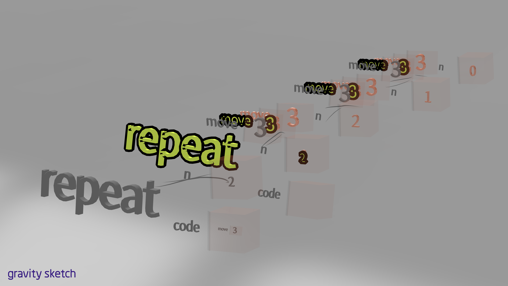

> *He's intelligent, but not experienced. His pattern indicates two dimensional thinking.*
>
>— Spock

In Pebble graphics programming pieces exist in a three dimensional space and while it does take advantage of this extra dimension in some ways, I’ve felt it’s been underutilized. This was reinforced after showing it to someone who remarked it felt like it was kind of a 2.5D system sitting somewhere in between a 2D visual language like Scratch and something that wouldn't really work without 3D. After some thinking and prototyping with Gravity Sketch, one of the ideas I’m excited about is using the third dimension to visualize time.

Most programs are represented statically, usually as text or sometimes visualized as blocks or nodes and wires. Even if the programming system allows one to watch or step through the execution, at any given moment the programmer only has a point in time glimpse of the dynamic process defined by the program. This adds a mental burden to the programmer to keep track of what’s going on in their head. One way to use the third dimension of spatial computing is to display each step of the computation as it happens. The examples below are one possible way to do this.

The above image shows an expression that might be traditionally represented as **repeat(2, “move(3)”)**, which executes the code **move(3)** 2 times (or 3 since we’re programmers :-)).
Each step of execution creates a new copy of the expression advanced by one step, let’s call each of these copies a frame. This also applies to subexpressions so e.g. within a frame there might be “sub-frames” as subexpressions get evaluated. These frames and subframes are easier to see in the videos below.

<iframe width="560" height="315" src="https://www.youtube.com/embed/Cbavtk9SyKc" title="YouTube video player" frameborder="0" allow="accelerometer; autoplay; clipboard-write; encrypted-media; gyroscope; picture-in-picture" allowfullscreen></iframe>

<iframe width="560" height="315" src="https://www.youtube.com/embed/V54aiGrPEfs" title="YouTube video player" frameborder="0" allow="accelerometer; autoplay; clipboard-write; encrypted-media; gyroscope; picture-in-picture" allowfullscreen></iframe>

<iframe width="560" height="315" src="https://www.youtube.com/embed/gyjD5-omoe4" title="YouTube video player" frameborder="0" allow="accelerometer; autoplay; clipboard-write; encrypted-media; gyroscope; picture-in-picture" allowfullscreen></iframe>

Sometimes when I’m working on things like fixing label orientations or button sizes it’s easy to forget how exciting it can be to work in XR. Getting into Gravity Sketch and playing around with new ideas is a great reminder for how much potential there is to invent new ways of computing. Visualizing a program’s execution over time using the extra space a 3D environment provides is just one way in which spatial computing could help make [difficult tasks in programming](../turtles-all-the-way/) easier and I’m looking forward to exploring more in the future.
