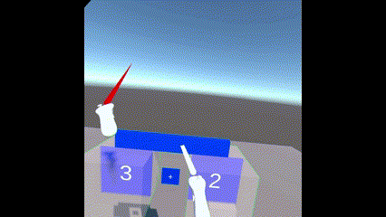
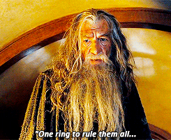
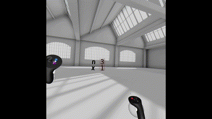
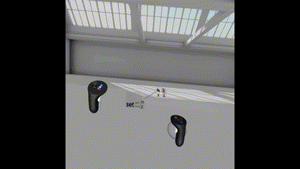

One of the pros (and sometimes a con) with not having strict deadlines is being able to start over again. After re-designing program execution to better [utilize 3D space](../its-3d-time/), learning about the XR Interaction Toolkit made by Unity, and thinking of different designs for other parts of the system, I decided there were enough changes I wanted to make that starting from a new code base made sense. I have an early version of the 3D history for some simple expressions and so far I like where it’s going.

Another major part of the system I wanted to change was how abstraction worked, both for data and computation. In the first version there was a loop construct and this took on the role of the more traditional function since you could add parameters to it and it acted as a container for a sequence of other computable objects. I liked the simplicity of everything being a loop, but in practice it just didn't feel that great.

As I was thinking through the content of a tutorial the “one loop to rule them all” concept weirdness was even more pronounced (a good lesson for me was if you want to find out which parts of your system might need to be re-designed, think about how you would teach someone to use it). So I fired up Gravity Sketch and here's what I came up with.

## Data
The first thing I wanted to do was rethink how the user would work with data. There wasn’t really a way to represent an array of data, which is pretty common in programming so as I was thinking about introducing arrays I decided on the representation below, which is kind of like a symbol table in more traditional programming languages.

Here we have a sequence of containers where each container has a corresponding symbol. In this case the symbols are 3D text, but one thing I’d like to try in the future is to make it more generic and have any 3D object or even an animation be the symbol.

To create an instance of a variable you would grab the symbol and pull out a copy of it. Evaluation of the symbol takes the contents of the corresponding container and that acts as the result or value returned by the variable.

## Stateful Computation
As I was thinking through the re-design of execution history and its 3D visualization I also wanted to show the history of how data changed. Below is an example where executing an update to a variable creates a visual record of the state of the variable before the change.

More generally I want to make it easy to see the history of any stateful computation e.g. calling Move or Rotate will create and record the state that is being changed and display it visually in the execution history. Below the Move command is moving forward the green object and we can see past execution history of Move links to previous states of the green object.

## Abstraction
The key to general computation is abstraction. Being able to assign a symbol to a computation by sticking it into a container in the global symbol table (or scope) is a first step towards abstraction, but what we really need is to be able to replace parts of the computation with variables. We just described a representation for global variables so let’s just re-use it at a smaller scale.

Here we see an entry in the symbol table where the container itself has its own symbol table and the contents in the container is a computation that references that table. This can be thought of as a local scope. Creating a reference to the data table entry now creates a copy of the label, but this time the label has a data table where the values can be set and used as arguments to the computation.

We could also mimic an object system using symbol tables by attaching a symbol table to any 3D object and the entries would represent members and methods, but I think that’s a goal for another non-deadline.