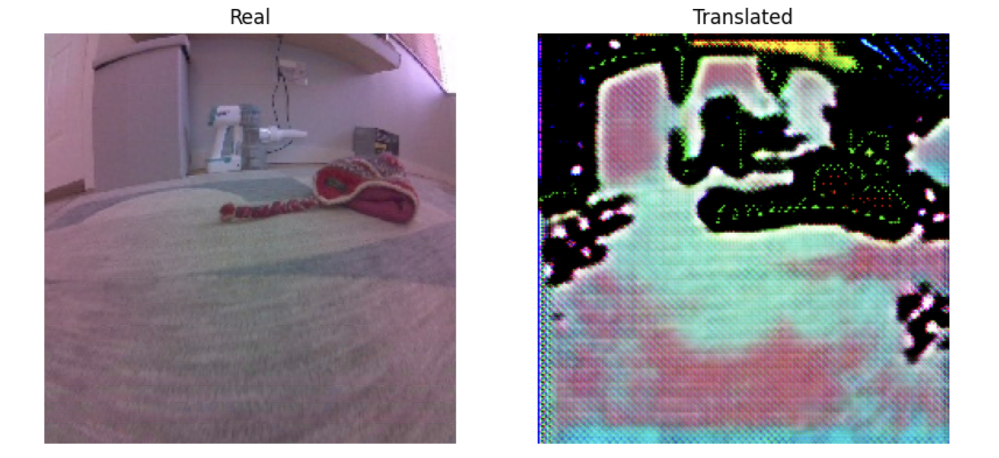

*Note: when I mention sim2real I mean a simulation programmed by humans e.g. like a game engine*

In my last [post](../basic-sim2real/) I had just started with sim2real and now I'm done. I tried to get sim2real to work for a simple vision-based task and, based on the experience, I now believe training a world model on real data is a more promising approach. Unfortunately I didn’t keep notes while working on this project and it’s been about eight months since I stopped, but here is a brief summary and some reflection on what I tried.

I decided to start with the task of having a Jetbot move toward a Kong in its visual field. It took some experimentation with getting the right environment and reward setup to train a policy using deep reinforcement learning, but I was able to get something working using the built-in Isaac Lab libraries. I vaguely recall the main issue I ran into was with improper input normalization and debugged it by visualizing features in the CNN layers ([notebook here](https://github.com/ih/jetbot-kong-finder-debugging/blob/main/kong-finder-network-visualization.ipynb)), but I don’t remember the details. 

*As an aside, I originally planned to write this post at the end of the project, but not having notes pushed me to put it off until now. On the plus side, that motivated me to maintain a log for the following project so that I’d have an easier time writing it up.*

Here’s a video of the simulated Jetbot in action as well as the [main file](https://github.com/ih/JetbotSim2RealKongFinder/blob/main/jetbot/jetbotenv.py)
used for training.

<iframe width="560" height="315" src="https://www.youtube.com/embed/rwOF2KrQEBI" title="YouTube video player" frameborder="0" allow="accelerometer; autoplay; clipboard-write; encrypted-media; gyroscope; picture-in-picture" allowfullscreen></iframe>

Unfortunately transferring the policy from simulation to reality was much more difficult and I didn’t get it to work. Here are a few things I tried and none of them showed qualitative improvements in transfer to the real Jetbot.

The first thing was adding randomization to the environment. Changing the color of the Kong each time it spawned was fairly straightforward using Isaac Sim’s [replicator feature](https://github.com/ih/JetbotSim2RealKongFinder/blob/2d7b9511870160b2dca95d143c000997609b2a7a/jetbot/jetbotenv.py#L242). I vaguely recall due to how environments are duplicated to run in parallel changing things like scale or shape proved difficult or impossible. I ended up not pursuing that further since the Kong spawned at various distances and orientations anyway. I did end up randomizing the lighting later, but that didn’t help. I believe I ran some experiments on whether the kong was being recognized and it was so I didn’t pursue adding random background objects.

The next thing I tried was to make the simulation closer to the real environment by adjusting the parameters of the simulated camera lens and adjusting the color of the simulated video to match more closely the reddish hue of the real camera. Making these kinds of tweaks is probably when I started to feel like sim2real wasn’t the right approach for training models in robotics. 

The last major idea I tried was to use style transfer to make real images captured by the robot look similar to the simulated images. The plan was to then feed those style-transferred images into the model that had been trained in simulation.  [My attempts](https://github.com/ih/JetbotSim2RealKongFinder/tree/main/style_transfer) at style transfer didn’t work. 

I could have continued to try and improve the style transfer model, but I was already thinking about other approaches to learning in robotics so decided to stop.

I felt using a human programmed simulation was the wrong approach after trying to get sim2real working. There are plenty of examples where it does work, but for me, there were too many gaps between simulation and reality e.g. the 3D model of the robot and its environment, the accuracy of the physics engine, or tuning the parameters of the camera model and lighting. It felt like a lot of the existing methods for closing the sim2real gap like domain randomization were band-aids on a deeper problem that there was always going to be a significant human engineering challenge in programming the simulation. Around this time I had come across projects for world modeling in video games like [Dreamer](https://danijar.com/project/dreamerv3/), [DIAMOND](https://diamond-wm.github.io/), and [Oasis](https://oasis-model.github.io/). These projects essentially train a model on real gameplay to then act as a simulation of the game. So given an image from the game and an action the models can predict what the next image the user/agent should see based on that action. The idea of training a model of the world directly on world data seemed much more scalable than manually programming realistic simulations.  Robotics seems like a great application of these ideas so I decided to move on from sim2real.

