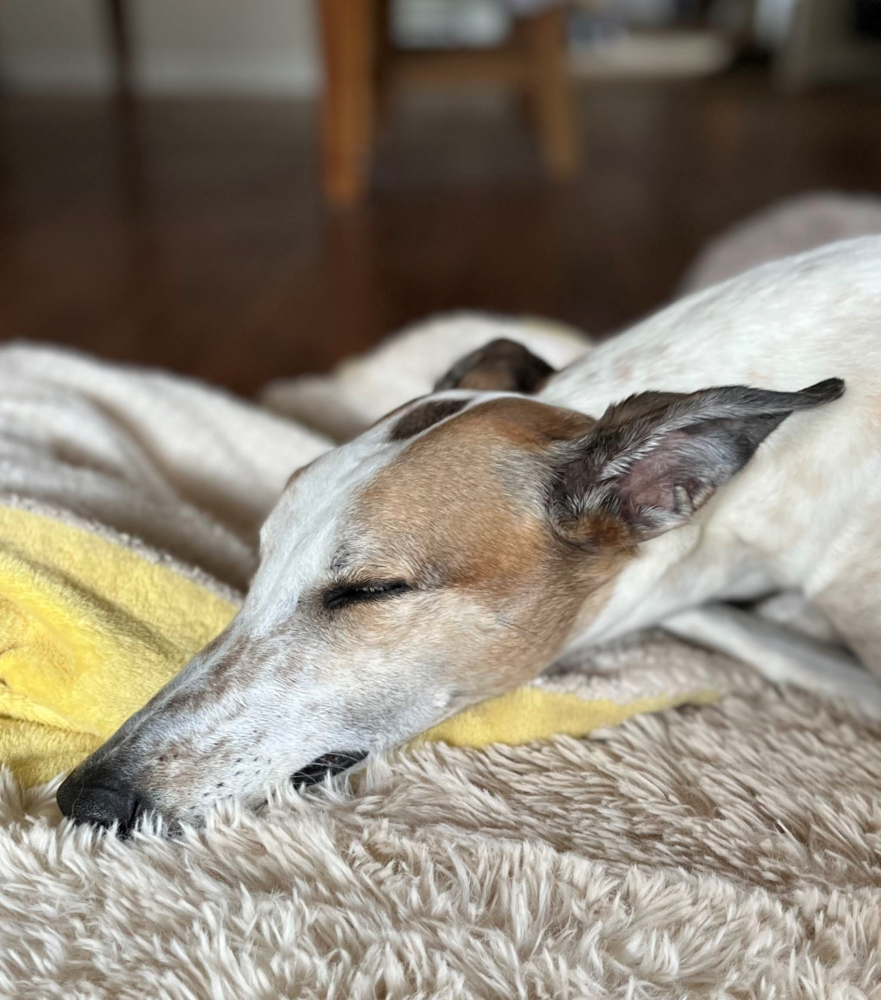

> *When we study Japanese art, we see a man who is no doubt wise, philosophical and intelligent. And how does he spends his time? Studying the distance between the earth and the moon? No. Studying the political theories of Bismarck? No. He studies a single blade of grass. But this blade of grass leads him to draw plants of all kinds, then the seasons, the overall aspects of the landscape, then animals, and finally, the human figure. This is how he spends his life, and life is too short to do the whole.* 
>
>— Vincent van Gogh

This is Pebbles.

She's the protagonist of an application I'm making called Pebble Graphics and if it had a tagline it would be [turtle graphics for a new generation](../started-from-the-bottom/).

Why Pebble Graphics? In a lot of ways it's a "single blade of grass" of programming systems. There will be a few primitive commands: pen down, pen up, move, and turn. Loop and branch structures to organize and control the flow of execution. Functions and variables to create abstractions and that's about it. One of the main ideas I'd like to explore with this system is making program construction a more interactive process.

My programming process often follows a cycle of edit-execute-debug where I'm operating in a different mode with each step. When I'm editing I'm in an IDE typing text, when I'm executing I'm using the program like the end user seeing if things work as expected and when I'm debugging I'm either running the program like before or using a debugger that lets me step through the execution of the program and inspect data. This process can end up being pretty tedious since I usually want to make a series of quick changes and inspections as I'm programming to see how things work or what's wrong, but each change means going through the whole cycle again switching from mode to mode. What I'd like to try with Pebble Graphics is to combine edit and debug into a single mode where you're constructing the program and then have another mode for running the (ideally) completed program as the end user.

The way I'd like this to work is you're in the middle of running your partially completed program and you add the next step, see what happens, then undo it if necessary to try something else and then continue on incrementally executing and developing the program in a seemless fashion. I think the key part will be making it easy to get data to a previous state or more generally see and manipulate it as you're running and modifying the program. I'm not entirely sure how or if it's going to work and there's a lot to building Pebble Graphics outside of this particular idea, but Pebbles and I are excited to try! 

(Pebbles maybe a little less so)

